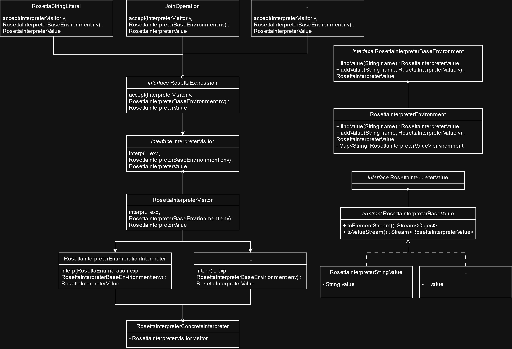

# Rune DSL Interpreter

An interpreter for a subset of the Rune DSl.

For more information, refer to the [original Rosetta readme file](README_project.md)

## How to build

Refer to the main building instructions in the original readme.

Additionally, open the `interpreternew` module.

If the project still doesn't build try the following steps:
- Mark [xsemantics gen](rosetta-lang/target/xsemantics-gen/main/java/) as a source folder
- Close the projects: `com.regnosys.rosetta.ide`, `com.regnosys.rosetta.profiling`, `com.regnosys.rosetta.tools`, `rosetta-maven-plugin`
- Update the Maven project

## Project Structure

Rune operations are defined in [xcore files in the model folder](rosetta-lang/model/). The constructs defined there get auto generated into the generated source folders. They correspond to the objects that the parser can return, and thus are essential for ensuring compatibility with it. It does have some limitations, such as the lack of the notion of many data types, like streams, so some general operations are defined outside those files if they concern more complicated Java constructs. All objects generated via xcore have som associated EObject methods required for them, that are used to get back the original semantics of how they were generated. Thus to implement those methods, the generated objects we make use of also implement `MinimalEObject` to get a base implementation of those methods, if nothing custom is required.

All interpretable operations implement an interp method which takes in a visitor and an environment.

There is a visitor which accepts the expressions and passes them along to the correct concrete interpreter to perform their operations.

Each concrete interpreter in the [interpreters module](rosetta-interpreter/src/main/java/com/regnosys/rosetta/interpreternew/visitors/) concerns the interpretation of a certain thematically linked part of Rune operations. For example the List Operators interpreter interprets list `exists`, `absent`, `first`, `only`, `last`, `distinct`, `reverse`, `sum` as they all apply an operation to a list of values and they are somewhat similar in their implementation pattern.

The program flow starts in the [main interpreter file](rosetta-interpreter/src/main/java/com/regnosys/rosetta/interpreternew/RosettaInterpreterNew.java). It contains fields for the visitor and the environment and keeps track of them. When interrpetation is started, this class is used by calling its `interp` method. This starts the interpretation flow and keeps track of the environment

## Error handling and preservation of semantics

All the operations are implementations of `EObject` so they retain information about the original text they were generated from and all other metadata about the parsing process. Thus it is important to preserve that information through the interpretation process.

When an error is encountered, it gets associated with an EObject, such that more diagnostic information can be retaing from it. Currently, the information that is given to the user is the position in the source code of the text that generated the error constructs, though in the future this functionality could be extended.

Errors are stored as `RosettaInterpreterErrorValue`. When an interpretation function encounteres an error value, it should try to propagate that error further up in the computation. This can be achieved by scanning through all the inputs received, and if any errors are found, returning them. The `RosettaInterpreterErrorValue.errorsExist()` and `RosettaInterpreterErrorValue.merge()` methods can be used for those purposes.

## Testing

The benchmark for good testing coverage for this project is 100% branch coverage, and should be achieved wherever possible.

Tests are created in the [interpreter test folder](rosetta-interpreter/src/test/java/com/regnosys/rosetta/interpreternew/)

Useful tools for the testing process:
- Expressionparser: allows for parsing a string representation of a Rune expression into a `RosettaExpression`
- ExpressionFactory: allows for directly instantiating an expression object
- ExpressionValidationHelper: allows for validating that a parsed expression is actually a valid Rune expression

## Checkstyle

The [checkstyle file](checkstyle-SP.xml) is enforced for the project. It is not a very strict checkstyle, but ensures some style guidelines and helps with readability of the codebase.

## CI/CD Pipeline

The [pipeline](.gitlab-ci.yml) runs on the repository after each pushed commit.

It consists of three stages:
1. Build - ensure the codebase compiles and builds successfully
2. Test - run all the tests and ensure they all pass
3. Checkstyle - check all Interpreter source files and ensure they adhere to the checkstyle

## How to extend

### New Expression
The simplest extension is by adding new Rune constructs to interpret. The process for this is:
 1. Define the interp method for this expression in [RosettaExpression.xcore](rosetta-lang/model/RosettaExpression.xcore)
 2. Create a new class inside [interpreternew.visitors](rosetta-interpreter/src/main/java/com/regnosys/rosetta/interpreternew/visitors/) OR use one of the already existing ones if it fits thematically
 3. Implement a new interp method in [RosettaInterpreterVisitor.java](rosetta-interpreter/src/main/java/com/regnosys/rosetta/interpreternew/RosettaInterpreterVisitor.java) to accept the new expression
 4. Implement the interpretation of the expression
 5. Test the expression in [the testing module](rosetta-interpreter/src/test/java/com/regnosys/rosetta/interpreternew/visitors/)

### New Value Domain Type
Right now this process doesn't have any additional steps, but this may change in the future.

1. Create a new class in [the value domain folder](rosetta-interpreter/src/main/java/com/regnosys/rosetta/interpreternew/values/)
2. Test the class if it requires it

### New Expression Function

Currently there is only the interpretation function defined for the expressions, but the visitor pattern allows for adding a new one.

1. Create a new main visitor (like RosettaTypeCheckVisitor)
2. Define accept methods for this visitor for all the expressions
3. Implement concrete acceptors in the new visitor or in new files stemming from it

## Authors
- Jacek Kulik
- Antonio Lupu
- Maria Cristescu
- Bogdan Damian
- Diana Şutac